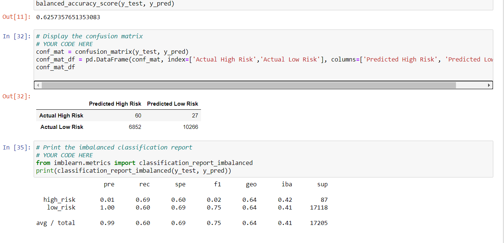
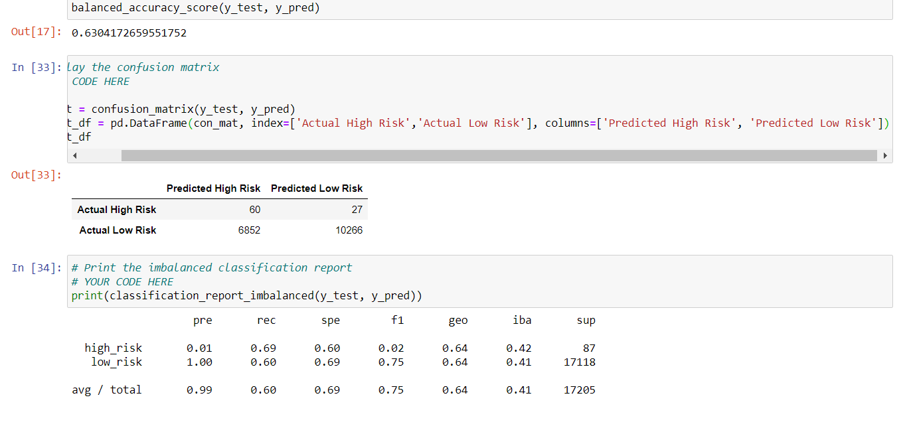
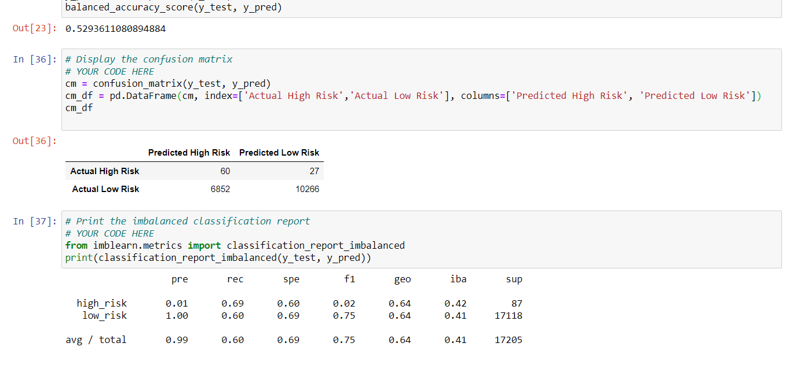
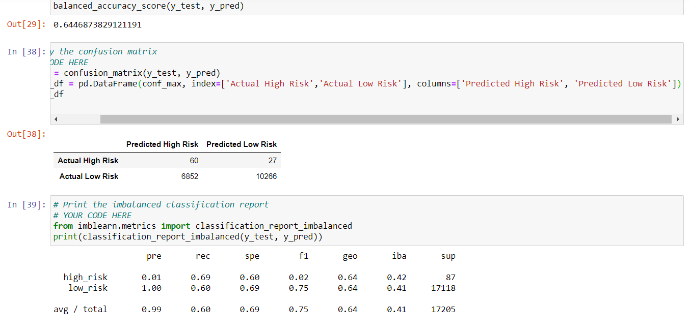
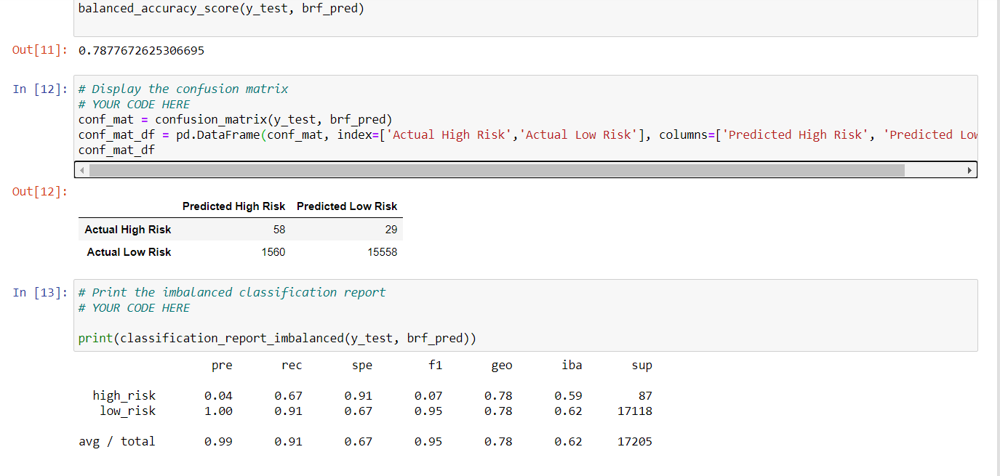
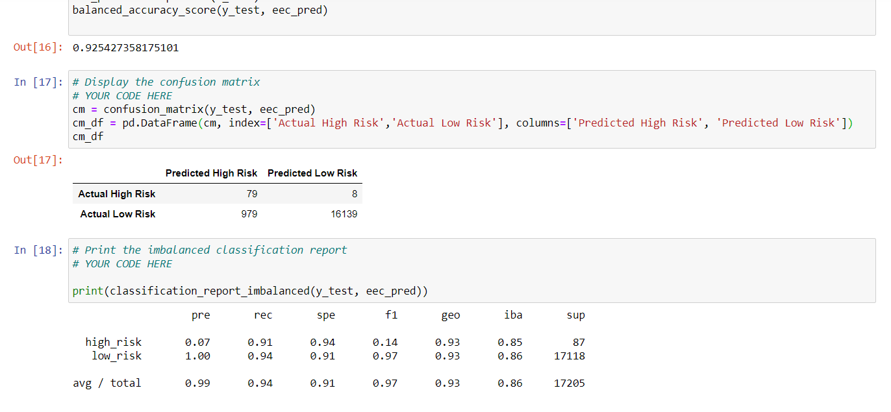

# **CREDIT RISK ANALYSIS**

## **PROJECT OVERVIEW**
This project is about the Credit Risk analysis of an unbalanced dataset whereby there are a large number of good loans as compared to bad loans, therefore I had to apply different techniques to *train* and *evaluate* the unbalanced classes. I have used techniques like Oversampling, Undersampling, Combinatorial approach and then two new Machine Learning models that reduce bias to predict the credit risk.
## **RESULTS**
Below is the result of different techniques used alongwith the code snippet.

**1- RandomOversampler**

Here are the key results:

    * Balance Accuracy Score    0.62
    * Classification Report
    
                    Precision       Recall
    High Risk       0.01            0.69
    Low Risk        1.00            0.60
    Avg/Total       0.99            0.60

**2- SMOTE Oversampling

Here are the key results:

    * Balance Accuracy Score    0.63
    * Classification Report
    
                    Precision       Recall
    High Risk       0.01            0.69
    Low Risk        1.00            0.60
    Avg/Total       0.99            0.60

**3- Undersampling- ClusterCentroids

Here are the key results:

    * Balance Accuracy Score    0.53
    * Classification Report
    
                    Precision       Recall
    High Risk       0.01            0.69
    Low Risk        1.00            0.60
    Avg/Total       0.99            0.60

**4- Combinatorial- SMOTEENN

Here are the key results:

    * Balance Accuracy Score    0.64
    * Classification Report
    
                    Precision       Recall
    High Risk       0.01            0.69
    Low Risk        1.00            0.60
    Avg/Total       0.99            0.60

**5- Balanced RandomForestClassifier

Here are the key results:

    * Balance Accuracy Score    0.79
    * Classification Report
    
                    Precision       Recall
    High Risk       0.04            0.67
    Low Risk        1.00            0.91
    Avg/Total       0.99            0.91

**6- EasyEnsemble- AdaBoost

Here are the key results:

    * Balance Accuracy Score    0.92
    * Classification Report
    
                    Precision       Recall
    High Risk       0.07            0.91
    Low Risk        1.00            0.94
    Avg/Total       0.99            0.94

## **SUMMARY**

The above results shows that there is hardly any difference between all the four Oversampling and Undersampling techniques and these models are good in precision rates of *Low Risk* loans.

When we apply the Machine Learning models which reduce bias (Random Forest Classifier and Easy Ensemble-Adaboost), the score improves for all the parameters.

Another fact comes out from all these models is that our dataset has very less number of False Negatives especially in the last model (Adaboost) which explains the higher Recall score of High Risk Loans in this model.

**Recommendation**

For this dataset, I would like to recommend use of **AdaBoost** model because of higher Recall Score and higher F1 sore (0.97). The precision score of all the models is almost the same but because of higher Recall score especially for High Risk loans, I would like to go with AdaBoost.
